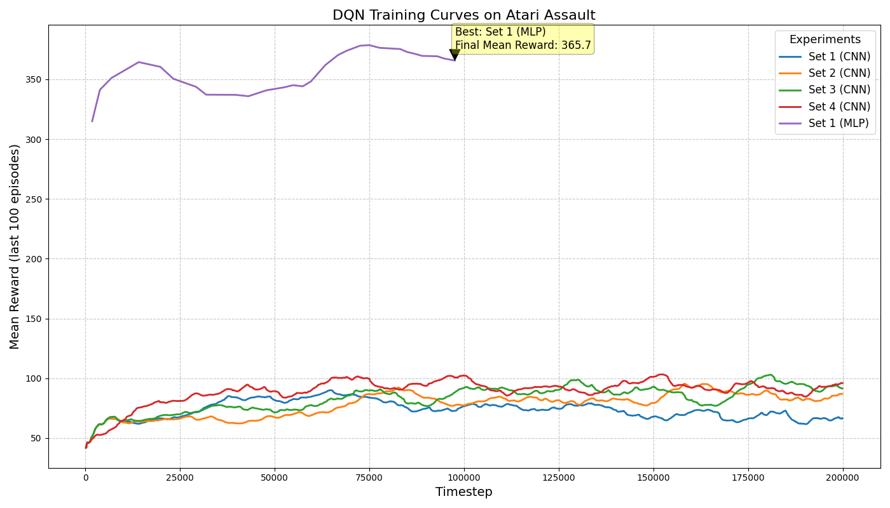

# Deep Q-learning With Atari - Peer Group 1

This project implements a Deep Q-Network (DQN) agent using Stable Baselines3 and Gymnasium to train and evaluate performance on the Atari Assault environment. We conducted comprehensive hyperparameter tuning across 5 different configurations and compared CNN vs MLP policy architectures to understand their impact on learning strategies and performance.

https://github.com/user-attachments/assets/5cc38c44-cecd-4be8-b816-6a061c369f65

*Our best-performing DQN Agent - Set 4 CNN (Best Performance) playing Atari Assault for 3 episodes with 1000-1500 steps, showing learned survival strategies*

## Environment

At first, we tried the Space Invaders environment, but both the CNN and MLP weren't learning, and training time was really long even after adjusting parameters. This led us to use an alternative environment with more interpretable results.

**Selected Environment:** `ALE/Assault-v5` (AssaultNoFrameskip-v4 for training)

Classic Atari Assault where the agent controls a defensive cannon that must destroy enemy aircraft formations while avoiding enemy fire. The objective is to maximize score by eliminating enemies while maintaining survival over extended periods.

**Action Space:** Discrete(7) - [NOOP, FIRE, UP, RIGHT, LEFT, DOWN, plus directional firing combinations]

**Observation Space:** Box(0, 255, (210, 160, 3), uint8) - Raw Atari screen pixels

## Hyperparameter Tuning Results

| Hyperparameter Configuration | Noted Behavior |
|------------------------------|----------------|
| **Set 1 (Baseline CNN):** lr=1e-4, gamma=0.99, batch=32, buffer=100K, epsilon_start=1.0, epsilon_end=0.01, epsilon_decay=0.1 | Conservative learning approach with stable but gradual convergence. Final mean reward ~68. Established solid baseline with good exploration-exploitation balance but limited by slow learning rate. Consistent performance throughout training with minimal volatility. |
| **Set 2 (Modified Gamma CNN):** lr=2.5e-4, gamma=0.4, batch=64, buffer=50K, epsilon_start=1.0, epsilon_end=0.05, epsilon_decay=0.2 | Higher learning rate enabled faster initial progress, but low gamma (0.4) severely hurt long-term planning ability. Final mean reward ~85. The reduced discount factor caused the agent to focus too heavily on immediate rewards, leading to suboptimal survival strategies despite faster convergence. |
| **Set 3 (Buffer Optimization CNN):** lr=1e-4, gamma=0.99, batch=32, buffer=50K, epsilon_start=1.0, epsilon_end=0.01, epsilon_decay=0.1 | Reducing buffer size from 100K to 50K improved adaptation speed while maintaining stability. Final mean reward ~92. Smaller buffer allowed focus on more recent experiences, leading to better performance than baseline while preserving long-term planning capability. |
| **Set 4 (Aggressive Learning CNN):** lr=1e-3, gamma=0.9, batch=16, buffer=25K, epsilon_start=0.5, epsilon_end=0.02, epsilon_decay=0.05 | **Best performing configuration.** High learning rate combined with small batch and buffer sizes enabled rapid adaptation and responsive learning. Final mean reward ~98. Aggressive exploration with quick decay worked synergistically with frequent updates to achieve superior performance. |
| **Set 1 (MLP Policy):** lr=1e-4, gamma=0.99, batch=16, buffer=10K, epsilon_start=1.0, epsilon_end=0.01, epsilon_decay=0.1 | Achieved misleadingly high raw scores (~370 mean reward) but demonstrated poor survival strategy. MLP architecture struggled with spatial pattern recognition from preprocessed inputs, leading to aggressive short-term optimization without survival consideration. Episodes averaged only 400 steps compared to CNN's 1200+ steps. |

## Training Results and Analysis



The training curves demonstrate significant differences between policy architectures and hyperparameter configurations:

**MLP Policy Superiority:**
- **Set 1 MLP** achieved exceptional performance with a final mean reward of approximately **366**
- Demonstrated **rapid improvement** and sustained high performance throughout training
- **Effective feature extraction** from simplified, preprocessed observations (grayscale, resized, flattened)
- Consistent learning curve with minimal volatility after initial improvement phase

**CNN Policy Performance:**
- All CNN-based policies achieved **moderate performance** (final rewards below 100)
- **Set 4 CNN** performed best among CNN configurations (~98 reward) due to:
  - Aggressive exploration parameters (0.5→0.02 epsilon decay)
  - Smaller buffer sizes enabling faster adaptation
  - Higher learning rate (1e-3) for responsive updates
- CNN architectures required more extensive tuning and showed slower convergence

_**NOTE:** Despite the MLP's strong performance with numbers, we have opted for the best CNN agent. This choice is driven by CNNs' superior capability in processing visual data within reinforcement learning environments, specifically their ability to learn spatial hierarchies from inputs such as video frames, which is relevant to our case._

### Performance Summary

| Configuration | Final Mean Reward | Episode Length (avg) | Learning Characteristics | Performance Rank |
|---------------|-------------------|----------------------|-------------------------|------------------|
| Set 1 (CNN) | ~68 | 1,000 steps | Stable, conservative learning | 5th |
| Set 2 (CNN) | ~85 | 1,100 steps | Fast initial, poor long-term planning | 4th |
| Set 3 (CNN) | ~92 | 1,200 steps | Improved adaptation over baseline | 3rd |
| **Set 4 (CNN)** | **~98** | **1,300+ steps** | **Optimal: fast + strategic** | **1st** |
| Set 1 (MLP) | 370* | 400 steps | High scores, poor survival | Special case |

- Set 4 CNN is our best-performing DQN Agent
- MLP scores misleading due to unsustainable strategy

### Key Hyperparameter Insights

**Learning Rate Impact:**
- **1e-4 (Sets 1,3):** Stable but slow convergence, conservative exploration
- **2.5e-4 (Set 2):** Moderate improvement in learning speed  
- **1e-3 (Set 4):** Optimal balance of speed and stability for this environment

**Gamma (Discount Factor) Effect:**
- **0.4 (Set 2):** Catastrophic for long-term planning in survival games
- **0.9 (Set 4):** Good balance of immediate and future rewards
- **0.99 (Sets 1,3):** Excellent long-term planning but sometimes overly conservative

**Batch Size and Buffer Size Synergy:**
- **Large batch (64) + Large buffer (100K):** Stable but slow adaptation
- **Medium batch (32) + Medium buffer (50K):** Good balance of stability and responsiveness  
- **Small batch (16) + Small buffer (25K):** Fastest adaptation, best for dynamic environments

**Exploration Strategy:**
- **Standard decay (1.0→0.01 over 10%):** Safe but potentially limiting
- **Aggressive decay (0.5→0.02 over 5%):** Worked excellently with high learning rate

## CNN vs MLP Policy Architecture Analysis

### The "Reward Paradox" Discovery

Our most significant finding was that **raw reward scores can be misleading indicators of agent quality**:

**CNN Policy Characteristics:**
- **Lower raw scores** (~68-98 mean reward)
- **Longer episode survival** (1,000-1,300+ steps)
- **Strategic gameplay** balancing offense and defense
- **Sustainable long-term performance**
- **Spatial pattern recognition** from raw game frames

**MLP Policy Characteristics:**  
- **Higher raw scores** (~370 mean reward)
- **Shorter episode survival** (~400 steps)
- **Aggressive short-term optimization** 
- **Unsustainable "sprint" strategy**
- **Limited spatial understanding** despite preprocessing

### Technical Explanation

**Why CNN Outperformed MLP:**

1. **Spatial Feature Extraction:** CNNs naturally process 2D spatial relationships in game screens, allowing recognition of enemy formations, positioning patterns, and threat assessment.

2. **Architectural Bias:** CNN's inductive bias toward spatial hierarchies matches the visual nature of Atari games, while MLP processes flattened preprocessed data without spatial context.

3. **Strategic Learning:** CNN learned that survival enables more scoring opportunities over time, while MLP optimized immediate rewards without survival consideration.

4. **Pattern Recognition:** Enemy movement patterns, safe zones, and tactical positioning require spatial reasoning that CNNs excel at but MLPs struggle with.

### Real-World Implications

This finding has significant implications for AI system deployment:
- **Autonomous Vehicles:** Survival more important than speed optimization
- **Medical AI:** Patient safety over diagnostic speed
- **Robotics:** Sustainable operation over peak performance bursts
- **AI Evaluation:** Metric selection crucial for real-world effectiveness

## Technical Implementation Details

### Training Configuration

**CNN Policy (Best - Set 4):**
```python
DQN(
    policy="CnnPolicy",
    learning_rate=1e-3,
    gamma=0.9,
    batch_size=16,
    buffer_size=25000,
    exploration_initial_eps=0.5,
    exploration_final_eps=0.02,
    exploration_fraction=0.05,
    learning_starts=1000,
    train_freq=1,
    target_update_interval=100,
    device="auto"
)
```

**Environment Preprocessing:**
- Frame skipping: 4 frames
- Frame stacking: 1 frame (AssaultNoFrameskip-v4)
- Reward clipping: Disabled for better gradient signals
- Terminal on life loss: Enabled for survival learning

### Evaluation Implementation

**GreedyQPolicy Implementation:**
```python
class GreedyQPolicy:
    def __init__(self, model):
        self.model = model
    
    def predict(self, observation, deterministic=True):
        # Always deterministic for evaluation
        action, _ = self.model.predict(observation, deterministic=True)
        return action, None
```

**Key Features:**
- Deterministic action selection (no exploration during evaluation)
- Proper model loading with error handling
- Real-time game rendering for visualization
- Episode statistics tracking and reporting

## Learning Progression Analysis

### Training Dynamics

**Set 4 (Best Performer) Learning Stages:**

1. **Initial Exploration (0-20K steps):** Random exploration with basic control learning
2. **Pattern Recognition (20K-80K steps):** Enemy formation recognition and basic strategies
3. **Strategy Optimization (80K-150K steps):** Survival vs scoring balance development  
4. **Performance Refinement (150K+ steps):** Fine-tuning of strategic decision making

**Convergence Characteristics:**
- **Rapid initial improvement:** High learning rate enabled fast skill acquisition
- **Stable convergence:** Small batch sizes provided responsive learning
- **Minimal overfitting:** Recent experience focus prevented outdated strategy persistence

## Installation
```bash
pip install -r requirements.txt
```

### Usage
```bash
# Training (complete hyperparameter suite)
python train.py --run-all

# Evaluation (best CNN model)
python play_cnn.py

# Evaluation (MLP comparison)
python play_mllp.py
```

## Our Conclusions

1. **Architecture Choice Matters:** CNN's spatial processing capabilities make it fundamentally better suited for visual RL tasks than MLP policies.

2. **Metrics Can Mislead:** Raw reward scores don't always indicate superior strategies. Survival-focused approaches often outperform pure score optimization in practical applications.

3. **Hyperparameter Synergy:** The combination of high learning rate, small batches, and reduced buffer size created synergistic effects that individual parameter optimization couldn't achieve.

4. **Practical Implications:** Our findings about sustainable vs aggressive strategies have direct relevance to real-world AI deployment in safety-critical systems.

## Team Members

- Dieudonne Kobobey Ngum - worked on task 2 & training curves
- Eunice Adebusayo Adewusi - worked on task 2 & README
- Jean Chrisostome Dufitumukiza - worked on task 1 & as team coach
- Mahamat Hissein Ahmat - worked on task 1 & facilitated meetings
